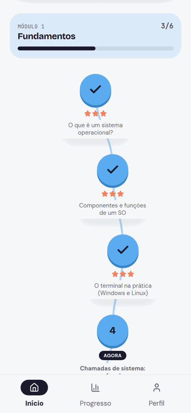
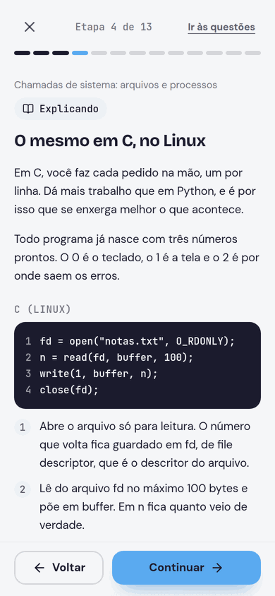
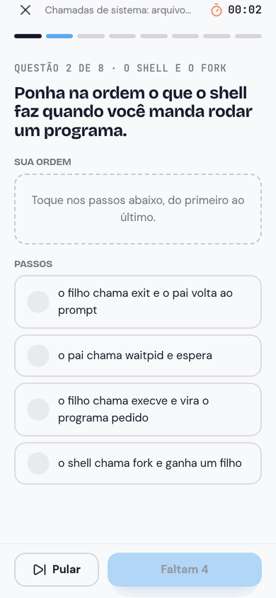
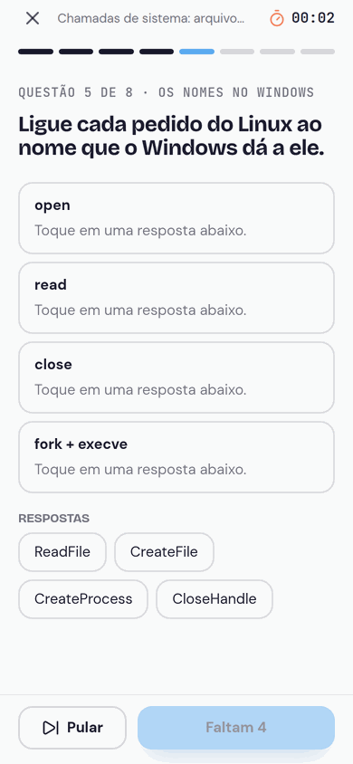
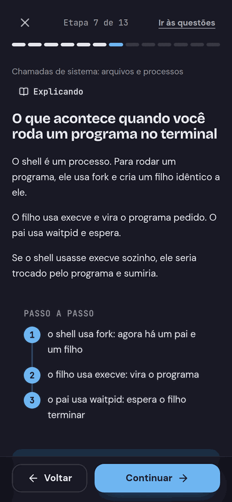
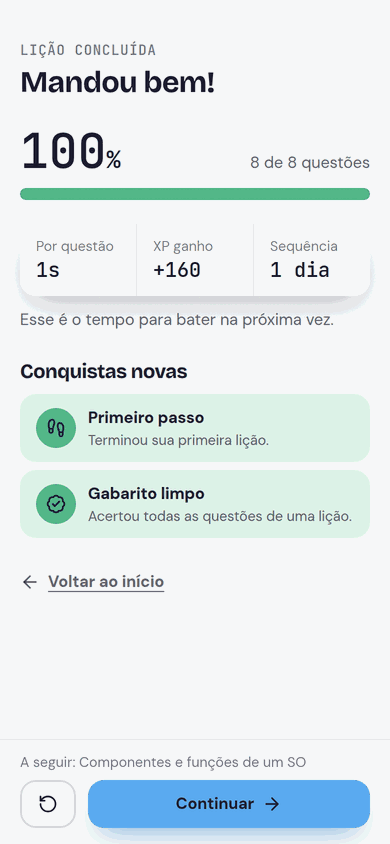

<h1 align="center">Castelei</h1>

<p align="center">
  Plataforma de estudos que ensina o conteúdo <strong>e</strong> a linguagem da prova.<br>
  Lição em etapas, uma ideia por tela, seguida de treino cronometrado em Modo Prova.
</p>

<p align="center">
  <a href="https://github.com/saviosant0s/castelei/actions/workflows/ci.yml"></a>
  
  
  
  
  
</p>

<p align="center"><strong>App no ar:</strong> <a href="https://frontend-production-3c7da.up.railway.app">frontend-production-3c7da.up.railway.app</a> — entra sem cadastro, em modo visitante.</p>

---

| A trilha da matéria | Código explicado linha a linha | Pôr os passos na ordem |
|---|---|---|
|  |  |  |

| Ligar os pares | Passos numerados, no escuro | O resultado da prática |
|---|---|---|
|  |  |  |

## O problema

Material de faculdade explica o assunto, mas não explica **como ele é cobrado**. O aluno entende a aula e erra a prova, porque a prova fala outra língua: "assinale a alternativa **incorreta**", "considerando o exposto", jargão de banca. E o que ele estudou em setembro já foi embora quando a prova chega, em dezembro.

O Castelei ataca os dois lados:

- **Cada lição tem três camadas** — a explicação humana, como o assunto cai na prova e as pegadinhas mais comuns. Uma ideia por tela, nunca um paredão de texto.
- **A revisão se agenda sozinha em função da data da prova.** O intervalo é uma fatia do tempo que falta, então o calendário se aperta conforme dezembro chega. Faltam 90 dias, a lição volta em 14; faltam 3, ela volta amanhã. A base científica, com as fontes, está em [`docs/revisao-espacada.md`](docs/revisao-espacada.md).
- **O conteúdo tem verificador automático**, que roda no CI como se fosse teste. Escrever lição aqui é uma disciplina de engenharia, não um campo de texto livre.

## Em números

| | |
|---|---|
| Matérias | 6 (Sistemas Operacionais, Servidores e VPS, Refatoração, Produção Textual, Matemática, Português) |
| Lições | 83, em etapas |
| Questões originais | 650, em quatro formatos (inclusive escrever) |
| Figuras SVG próprias | 78 |
| Testes | 267 no backend (PHPUnit) e 337 no frontend (Vitest) |
| Verificador de conteúdo | `scripts/lint-content.mjs`, roda no CI |

## Stack e desenho

```
castelei/
├── backend/    API Laravel 12 · Sanctum · PostgreSQL em produção, SQLite em dev e testes
├── frontend/   Next.js 16 (App Router) · React 19 · Tailwind 4 · PWA instalável
├── scripts/    verificador do Guia Editorial de conteúdo
└── docs/       planejamento, design system, decisões, deploy e guias
```

Três coisas que definem a arquitetura:

- **O navegador nunca fala com a API.** O Next guarda o token do Sanctum num cookie `httpOnly` e repassa só as rotas de prática. O token não fica exposto a JavaScript, e não há CORS para configurar.
- **A vitrine pública não cai junto com o backend.** `/`, `/materias` e `/como-funciona` leem o catálogo com prazo de 2,5 s; se a API falhar ou demorar, entra uma lista de reserva versionada — e um teste reprova se ela divergir do conteúdo de verdade.
- **Existe um único caminho de escrita em massa de conteúdo** (`ContentImporter`), usado tanto pelo seeder do deploy quanto pelo painel `/admin`. Dois caminhos para a mesma tabela viram duas regras diferentes na primeira correção feita em um só.

As decisões de engenharia mais interessantes — e o que cada uma custou — estão em **[`docs/decisoes.md`](docs/decisoes.md)**.

## Rodando localmente

Precisa de PHP 8.2+, Composer e Node 22+.

```bash
# 1) API
cd backend
composer install
cp .env.example .env && php artisan key:generate
touch database/database.sqlite
php artisan castelei:setup      # migrations + carga do conteúdo
php artisan serve               # http://localhost:8000

# 2) App (outro terminal)
cd frontend
npm install
cp .env.example .env.local      # API_URL=http://localhost:8000/api
npm run dev                     # http://localhost:3000
```

Com `GUEST_MODE=true` no frontend, as telas de entrar e cadastrar somem e cada navegador ganha uma conta de visitante. A API continua protegida por token.

## Testes

```bash
cd backend  && php artisan test
cd frontend && npm test && npm run lint && npm run build
node scripts/lint-content.mjs   # o verificador do conteúdo
```

O CI ([`.github/workflows/ci.yml`](.github/workflows/ci.yml)) roda os quatro a cada push.

## Os três formatos de questão

O padrão é `choice`: cinco alternativas e um `correct_index`. Continua sendo o principal, porque é o formato da prova que o aluno vai fazer. Os outros dois existem porque múltipla escolha só mede **reconhecer**:

- **`order` — pôr os passos na ordem.** `fork` vem antes de `execve`, liberar o SSH vem antes de ligar o firewall. Quem troca a ordem quebra a máquina, e a alternativa nunca cobra isso. As `options` são os passos escritos na ordem certa; não existe `correct_index`.
- **`match` — ligar os pares.** Em vez de `options`, traz `pairs` com `{left, right}`. Usar um par errado tira a opção certa de outro, então a pessoa precisa saber os quatro ao mesmo tempo.

Nos dois casos **o gabarito é a própria estrutura da questão**, então o servidor embaralha antes de entregar, com semente derivada de `(tentativa, questão)`: a ordem é reproduzível nas duas pontas sem guardar estado, e duas pessoas na mesma questão veem ordens diferentes. Um teste garante que o sorteio nunca devolve a ordem certa.

## Escrevendo conteúdo

As lições ficam em `backend/database/seeders/content/*.json` — essa é a fonte de verdade. Cada lição tem `summary`, `steps` (as etapas, uma ideia por tela) e `questions`.

Uma etapa tem:

| Campo | Para quê |
|---|---|
| `kind` | `idea` (analogia inicial, sempre a 1ª), `explain`, `exam` (uma só), `pitfall` (uma só), `recap` (sempre a última) |
| `title`, `body` | título curto e parágrafos curtos (no máximo 75 palavras somadas) |
| `example` | exemplo resolvido: `label`, `lines` e `ordered` — marque quando trocar duas linhas de lugar estragaria o exemplo, e a tela desenha os passos numerados |
| `bullets` | lista de itens |
| `terms` | palavras novas explicadas nesta etapa (`word`, `meaning`) — é daqui que sai o vocabulário da matéria |
| `figure` | figura SVG do app: `src`, `alt` descritivo e `caption` |
| `code` | trecho de código: `label`, `text` e `notes` — uma frase por linha dizendo o que ela faz, **obrigatório**: quem lê a lição pode nunca ter visto código |
| `video` | vídeo: `src` (arquivo enviado pelo painel ou link do YouTube), `title`, `caption` e `poster` |

A matéria aceita `area` (a área do conhecimento onde ela aparece na tela inicial: `portugues`, `matematica`, `informatica`… — a lista está em `backend/config/castelei.php`), `exam_date` (`"2026-12-15"`), que é o prazo de onde sai todo intervalo de revisão, e a lição aceita `module`, o assunto que a agrupa na trilha.

Antes de enviar, rode o verificador:

```bash
node scripts/lint-content.mjs                  # tudo que já está publicado
node scripts/lint-content.mjs caminho/para.json  # um arquivo ainda não importado
```

Ele reprova frases com mais de duas vírgulas, "como vimos anteriormente", etapas longas demais, linha de código sem explicação, citação de livro ou autor e — o mais útil — **termo técnico usado antes de ser explicado**. Rodado pela primeira vez contra a matéria de Servidores, escrita à mão, ele acusou 499 usos de jargão sem definição anterior; a régua de explicar código acusou outros 205.

O Castelei é independente: **o conteúdo nunca cita livros, autores, capítulos ou páginas.**

## Painel de conteúdo (`/admin`)

Publicar matéria sem mexer em código nem esperar deploy: importar um JSON com a matéria inteira, editar lição e questão em um editor de blocos, ordenar lições e guardar imagem e vídeo. O guia completo está em [`docs/painel-admin.md`](docs/painel-admin.md).

Para liberar a primeira conta, defina `ADMIN_EMAILS` no backend; depois disso o caminho é `php artisan castelei:admin voce@exemplo.com`. Plano Pro **não** dá acesso: plano é sobre estudar, permissão é sobre publicar.

## Documentação

| | |
|---|---|
| [`docs/decisoes.md`](docs/decisoes.md) | as decisões de engenharia e o que cada uma custou |
| [`docs/planejamento.md`](docs/planejamento.md) | o planejamento e o Guia Editorial de Conteúdo |
| [`docs/design-system.md`](docs/design-system.md) | o design system próprio (sem biblioteca de terceiros) |
| [`docs/revisao-espacada.md`](docs/revisao-espacada.md) | a revisão espaçada e a ciência por trás dos números |
| [`docs/painel-admin.md`](docs/painel-admin.md) | o painel de conteúdo |
| [`docs/deploy-railway.md`](docs/deploy-railway.md) | o deploy (Railway, três serviços, deploy automático na `main`) |
| [`docs/play-store.md`](docs/play-store.md) | o caminho para a Play Store, via TWA |
| [`docs/sistemas-operacionais-mapa.md`](docs/sistemas-operacionais-mapa.md) | o mapa das 30 aulas do semestre |

## O que ainda não existe

Login com Google, pagamento (quando entrar, será pelo faturamento do Google Play), funcionamento offline de verdade e ranking. O corte entre grátis e pago já está decidido, e ainda não implementado: tudo que existe hoje fica no grátis, e o Pro ganha o simulado por matéria e níveis de dificuldade nas questões.

## Licença

[MIT](LICENSE). O código é livre; o conteúdo das lições é autoral.
